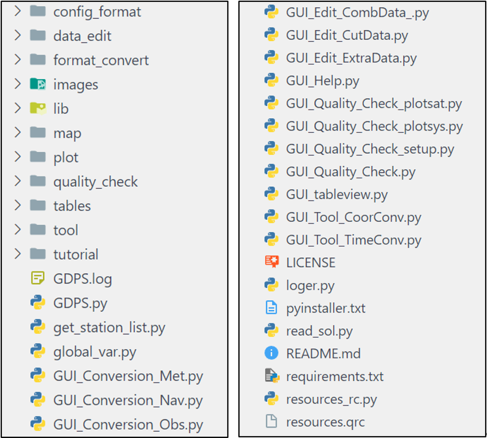
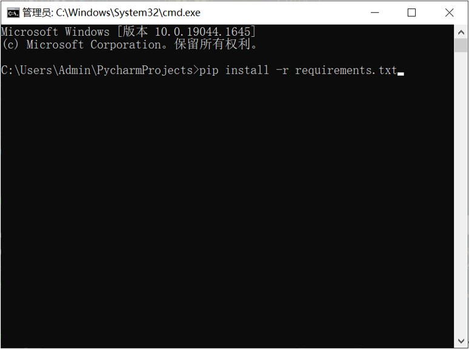
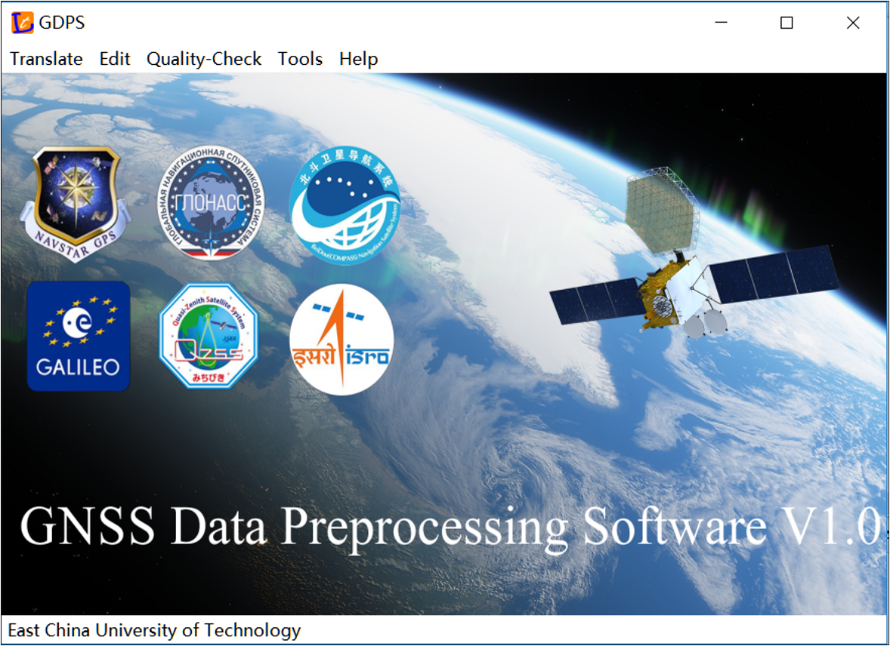

<!--
 * @Author: huweijian 1494170841@qq.com
 * @Date: 2024-06-14 11:28:02
 * @LastEditors: huweijian 1494170841@qq.com
 * @LastEditTime: 2024-07-15 15:24:12
 * @FilePath: \GDPS_v1a_2\src\README.md
 * @Description: 这是默认设置,请设置`customMade`, 打开koroFileHeader查看配置 进行设置: https://github.com/OBKoro1/koro1FileHeader/wiki/%E9%85%8D%E7%BD%AE
-->

# GDPS
an open source GNSS data pre-processing software
# The main features of GDPS
(1) GDPS provides an open-source Python-based interactive tool on Windows and Linux to preprocess multi-frequency and multi-system GNSS data, such as GPS, GLONASS, Galileo, BDS, QZSS, IRNSS, and SBAS. 
(2) GDPS supports format translation on different versions of RINEX 2.11~4.01 data files, such as observation data, broadcast ephemerides, and meteorological data. 
(3) GDPS supports editing processing based on RINEX data, including data segmentation, splicing, and extraction modules, to modify the required data record contents. 
(4) GDPS supports quality checking analysis of multi-GNSS data in terms of carrier-to-noise-density ratio, ionospheric delay rate, pseudorange/carrier phase multipath, pseudorange/carrier phase observation noise, data integrity/saturation rate, and single point positioning.

# Requirements
The executable program in the package is built by Pycharm 2019 and Python 3.7.0 with open-source, cross-platform compilation tools on Windows 10. Computer configuration requirements are as follows:
Operating systems: (Windows or Linux)
System type: 64 bit
Memory: at least 512MB
Software compilation needs to be run under an English path. If a Chinese path is used, some functional interfaces may experience a flashback phenomenon.
# Usage
## Step 1: Uncompress the GDPS.zip file, then get three folders (i.e. \data, \doc, and \src). "\src" represents the source code and its directory structure is shown in Fig. 1. 

Fig. 1 "\src" folder directory structure
## Step 2: Execute the installation command (pip install -r requirements.txt) through the console. Fig. 2 shows the input of the Windows environment.

Fig. 2 Installation package list
## Step 3: Create a project in Pycharm and run GDPS.py. Fig. 3 displays the software interface.
 

Fig. 3 GDPS main interface
